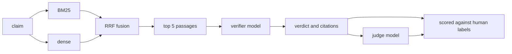

# rag-eval-harness

Retrieval and claim verification over SciFact, where the deliverable is the
evaluation rather than the pipeline. Every number here is scored against human
annotations, carries a confidence interval, and says when a difference has not
been shown.

## Run it

```sh
make install
make data
make retrieval
```

That much needs no API key and no account. It downloads the dataset, checks it
against a recorded hash, builds both indexes and scores them against the human
relevance judgments. The dense index takes about fifty minutes to build on CPU
the first time and is cached afterwards.

Verifying claims needs a model. `RAG_PROVIDER=ollama` runs it locally for free,
`RAG_PROVIDER=google` or `RAG_PROVIDER=anthropic` runs it against an API, and
the tests run on a deterministic stub that needs neither.

```sh
RAG_PROVIDER=ollama make generation
```

## What it does



## Retrieval

Scored on the 300 test queries, against the relevance judgments that ship with
the dataset.

The chosen configuration is hybrid retrieval with an RRF constant of 1 over
component rankings 100 deep.

| metric | hybrid | 95% CI |
|---|---|---|
| recall@1 | 0.5143 | [0.4623, 0.5706] |
| recall@5 | 0.7686 | [0.7213, 0.8158] |
| recall@10 | 0.8503 | [0.8110, 0.8870] |
| recall@20 | 0.8833 | [0.8490, 0.9177] |
| nDCG@10 | 0.6937 | [0.6535, 0.7347] |
| MRR@10 | 0.6448 | [0.6029, 0.6910] |

Against the two components it is built from, on the same 300 queries:

| configuration | ndcg@10 | recall@10 | delta ndcg@10 vs best | seconds |
|---|---|---|---|---|
| hybrid k=1 depth=100 | 0.6937 [0.6535, 0.7347] | 0.8503 [0.8110, 0.8870] | best | 8 |
| bm25 | 0.6622 [0.6172, 0.7080] | 0.7843 [0.7368, 0.8286] | -0.0315 [-0.0541, -0.0089] | 3 |
| dense | 0.6239 [0.5791, 0.6703] | 0.7743 [0.7273, 0.8160] | -0.0698 [-0.0992, -0.0428] | 5 |

BM25 on SciFact scores about 0.665 nDCG@10 in the BEIR paper. This
implementation lands at 0.6622, which is the check that matters: a hand written
scorer that had landed at 0.45 would look perfectly plausible with nothing to
compare it against.

## Ablations

Run on the 809 training queries, so that choosing a configuration never touches
the test split.

| configuration | ndcg@10 | recall@10 | delta ndcg@10 vs best | seconds |
|---|---|---|---|---|
| hybrid k=1 depth=200 | 0.7095 [0.6841, 0.7342] | 0.8436 [0.8190, 0.8674] | best | 25 |
| hybrid k=1 depth=100 | 0.7092 [0.6834, 0.7342] | 0.8436 [0.8190, 0.8674] | -0.0003 [-0.0017, 0.0011] (inconclusive) | 24 |
| hybrid k=0 depth=100 | 0.7091 [0.6833, 0.7348] | 0.8436 [0.8190, 0.8674] | -0.0004 [-0.0035, 0.0028] (inconclusive) | 29 |
| hybrid k=1 depth=50 | 0.7089 [0.6830, 0.7339] | 0.8425 [0.8185, 0.8666] | -0.0006 [-0.0021, 0.0008] (inconclusive) | 22 |
| hybrid k=2 depth=100 | 0.7087 [0.6826, 0.7337] | 0.8442 [0.8195, 0.8684] | -0.0008 [-0.0046, 0.0028] (inconclusive) | 24 |
| hybrid k=1 depth=10 | 0.7072 [0.6804, 0.7327] | 0.8398 [0.8163, 0.8642] | -0.0023 [-0.0054, 0.0006] (inconclusive) | 22 |
| hybrid k=1 depth=20 | 0.7072 [0.6804, 0.7327] | 0.8398 [0.8163, 0.8642] | -0.0023 [-0.0054, 0.0006] (inconclusive) | 21 |
| hybrid k=5 depth=100 | 0.7033 [0.6768, 0.7283] | 0.8428 [0.8185, 0.8668] | -0.0062 [-0.0126, -0.0000] | 27 |
| hybrid k=10 depth=100 | 0.6983 [0.6707, 0.7227] | 0.8402 [0.8146, 0.8632] | -0.0112 [-0.0196, -0.0033] | 25 |
| hybrid k=60 depth=100 | 0.6765 [0.6491, 0.7016] | 0.7991 [0.7724, 0.8224] | -0.0330 [-0.0445, -0.0222] | 26 |
| bm25 | 0.6670 [0.6386, 0.6945] | 0.7884 [0.7597, 0.8162] | -0.0426 [-0.0570, -0.0273] | 13 |
| dense | 0.6387 [0.6096, 0.6666] | 0.7668 [0.7375, 0.7940] | -0.0709 [-0.0893, -0.0551] | 20 |

The last column is the interval of the per query difference against the best
row, not a comparison of two separate intervals. Both configurations are scored
on the same queries, so the pairing is there to use, and discarding it calls a
real improvement a tie.

Two results worth reading off that table. The RRF constant of 60 that the
literature uses is close to the worst choice on this corpus, and the fusion
depth barely matters: everything from 50 to 200 is within noise of the best row.

## Verdict accuracy, and the judge that scored it

The verifier is `gemini-3.1-flash-lite`, over the 188 test claims that carry a
human verdict. It sees only the five retrieved passages.

| metric | value | 95% CI |
|---|---|---|
| accuracy | 0.8511 | [0.8031, 0.8989] |
| Cohen's kappa | 0.7074 | substantial |
| macro F1 | 0.5911 | |
| faithful citations | 1.0000 | |

| human \ predicted | CONTRADICT | NOINFO | SUPPORT |
|---|---|---|---|
| CONTRADICT | 53 | 9 | 2 |
| NOINFO | 0 | 0 | 0 |
| SUPPORT | 7 | 10 | 107 |

Kappa rather than accuracy alone, because SUPPORT outnumbers CONTRADICT close
to two to one here and a model that answered SUPPORT every time would score
well on accuracy and zero on kappa.

The macro F1 is low for a reason worth stating. The labelled claims are all
SUPPORT or CONTRADICT, so the NOINFO row is empty, and the nineteen times the
model hedged to NOINFO are all misses. Averaging F1 over a class that has no
examples pulls the number down without saying anything about the model.

Of the 28 wrong answers, 7 are cases where retrieval never surfaced a relevant
abstract and 21 are cases where it did. That split is the difference between
investing in retrieval and investing in the prompt. Every citation the model
produced pointed at a passage it was actually given.

The judge is `gemini-3.5-flash-lite`, a different model answering the same 188
claims independently.

| judge | value | 95% CI |
|---|---|---|
| accuracy against the human labels | 0.8085 | [0.7553, 0.8670] |
| Cohen's kappa | 0.6402 | substantial |

The judge agrees with the human annotators less often than the model it is
grading. That is the point of measuring it: a score from this judge is worth
what that agreement is worth, and quoting its verdicts without it would be an
opinion with decimal places.

## The gate

`make gate` compares a run against the recorded baseline and treats the two
halves differently.

Retrieval is deterministic. No model is involved, so any drop is a real change
and the tolerance is zero. The baseline also records which index, which
embedding model and which fusion constant produced it, and the gate refuses to
compare a run built on anything else.

Generation is not deterministic. Sampling controls were removed from the
current models, so two identical runs disagree and a tolerance picked by feel
fails on noise. The band comes from repeated runs instead, and until that
measurement exists generation reports without blocking.

<!-- VARIANCE -->

## What this dataset cannot measure

SciFact abstracts have a median of 204 words, so there is nothing for a chunk
size ablation to vary. Splitting a document that fits in a single passage
measures the splitter and not the retrieval. That ablation is absent on
purpose, and a second corpus with long documents is what would make it
meaningful.

The verdict labels cover 188 of the test claims, so the accuracy figures rest
on that many judgments rather than on the full 300.

## Cost

One full pass over the labelled claims is 376 calls, 188 to the verifier and
188 to the judge. It moved 661,502 input tokens and 23,328 output tokens, and
took 29 minutes.

On the Gemini free tier that is zero dollars and the cost is the quota
instead. None of these allowances are published any more, and they are not
uniform. Measured against the API rather than read off a page, by reading what
the 429 states:

| model | allowance |
|---|---|
| gemini-3.1-flash-lite | 15 per minute, 500 per day |
| gemini-3.5-flash-lite | 15 per minute |
| gemini-3-flash-preview | 20 per day |

The client paces itself to the per minute figure rather than earning a retry
delay of most of a minute, and lowers its own rate when a 429 names a smaller
one. A daily allowance that is gone ends the run with that number in the
message instead of sleeping until the reset.

Five repeated runs need 940 requests against a daily 500, which is why the
runs behind the variance figure are accumulated across days rather than
computed in one pass.

The Anthropic path is implemented and has not been run, so no dollar figure
for it is published here. The token counts above are what a reader would
multiply by their own rate.

Building the dense index is the other cost, about 50 minutes of CPU once,
cached on disk afterwards.

## Decisions

`docs/decisions.md` covers the choices behind the harness and what each one
costs, including why the judge is measured before it is used and why nothing
here is silently coerced into a valid answer.

## Source and licence

The dataset is the SciFact split distributed with
[BEIR](https://github.com/beir-cellar/beir). Claims and evidence annotations
are released by AI2 under CC BY 4.0 and the abstracts come from S2ORC under
ODC-BY 1.0. The code in this repository is MIT.
